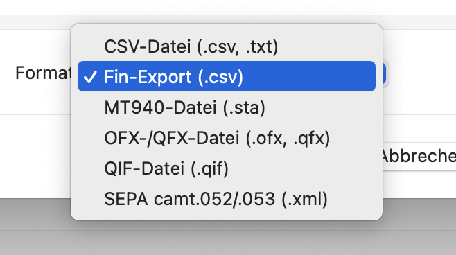

# Fin CSV Importer for MoneyMoney 

**CSV importer for [Fin - Budget Tracker](https://apps.apple.com/us/app/fin-budget-tracker/id1489698531)**

## Format

The following CSV format created by Fin is recognized:

```
Date,Name,Category,Amount,Source Currency,Target Currency,Conversion Rate,Latitude,Longitude
2022-07-05T20:20:00Z,Döner,Essen & Trinken,-5,EUR,EUR,"1,00",-,-
```

## Installation

* Ensure you have the beta version of MoneyMoney
* Ensure the signature check for extensions is disabled
* Place the extension in `~/Library/Containers/com.moneymoney-app.retail/Data/Library/Application Support/MoneyMoney/Extensions`

When the extension is correctly installed and recognized, a new entry should appear in the import dialog:



